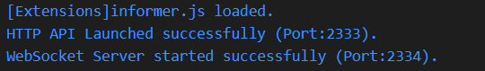

# BottleM-Backend
咱Minecraft服务器的主控端

## 目录

- [面向](#面向)
- [使用到的包](#使用到的包)
- [简介](#简介)
- [基本部署](#基本部署)
- [配置文件](#配置文件)
- [脚本与自制镜像](#脚本与自制镜像)
    - [自制镜像](#自制镜像)  
    - [使用默认脚本](#使用默认脚本)
    - [默认脚本对应的COS储存桶中存放的内容](#默认脚本对应的cos储存桶中存放的内容)
    - [关于Bash脚本的环境变量](#关于bash脚本的环境变量)
- [关于主控端状态](#关于主控端状态)
    - [主控端状态码](#主控端状态码)
    - [主控端发生错误时的状态码](#主控端发生错误时的状态码)
    - [发生错误时的操作](#发生错误时的操作)  
    - [特殊的情况](#特殊的情况)  
- [使用](#使用)
    - [请求HTTP API](#请求http-api)
        - [请求路径](#request-path)
        - [鉴权方式](#request-authorization)
        - [请求方式](#request-methods)  
        - [关于POST请求](#request-post)
        - [返回内容的公共字段](#request-pubfield)  
        - [错误信息](#request-errormsg)  
    - [通过WebSocket同步Minecraft服务器日志](#通过websocket同步minecraft服务器日志)  
        - [连接地址](#ws-address)  
        - [鉴权方式](#ws-authorization)
- [扩展](#扩展)
- [流程简述](#流程简述)
- [一些建议](#一些建议)  

## 面向

这个项目目前主要针对的是像朋友服一类的小型、**即开即玩**的**单个**Minecraft服务器。

Minecraft服务器部署过程由`Bash`脚本驱动。

## 使用到的包

| 包名 | 开源协议 |
|:---|:---|
| [tencentcloud-sdk-nodejs](https://github.com/TencentCloud/tencentcloud-sdk-nodejs/) | Apache License 2.0 |
| [ssh2](https://github.com/mscdex/ssh2) | MIT |
| [chalk](https://github.com/chalk/chalk) | MIT |
| [ws](https://github.com/websockets/ws) | MIT |
| [minecraft-protocol](https://github.com/PrismarineJS/node-minecraft-protocol) |  BSD-3-Clause license  |
| [rcon](https://github.com/pushrax/node-rcon) | MIT |

## 简介

这算是我第三次写这类应用了。梦开始的地方在这里：[CloudMinecraft](https://github.com/SomeBottle/CloudMinecraft)，而第二次我写的东西（叫LoCo来着，基于PHP）因为过于屎山没法开源<del>（但尽管如此，LoCo竟然在我服务器强撑运行了一年，可以说是奇迹了）</del>。  

好在这回，我勉强把这玩意写的能看下去了。(っ ̯ -｡)

本项目包括两个部分：`BottleM-Backend`和`BottleM-InsSide`，这个仓库存放的是`Backend`的源码。  

`Backend`咱就称为“**主控端**”，而`InsSide`咱就称为“**实例端**”吧！  

主控端主要负责接受用户请求，并管理实例的开通与回收；而实例端则负责**Minecraft服务器**的部署与管理。

绝大多数时候，**用户只与主控端进行交互**。<del>实例端：我透明啦๐·°(৹˃̵﹏˂̵৹)°·๐</del>

主控端和实例端之间通过```WebSocket```协议进行通信。不过就算`WebSocket`连接断开了，实例端也能保证Minecraft服务器的**数据安全**。

这玩意是怎么工作的？看看[流程简述](#流程简述)吧~

## 基本部署

1. 将项目克隆到本地，并进入目录

    ```bash
    git clone https://github.com/Bottle-M/BottleM-Backend.git
    cd BottleM-Backend
    ```

2. 安装依赖包

    ```bash
    npm install
    ```

3. 自制镜像，见[下方](#自制镜像)  

3. 修改/重写`./scripts/`下的部署脚本（最重要的一步）。如果你想使用我已经写好的脚本，不妨来看看[这里](#使用默认脚本)

4. 修改配置文件（[见下方](#配置文件)）

5. 启动HTTP API和WebSocket服务

    ```bash
    npm start
    ```

    输出示例：

      

    * `[Extension]`提示扩展模块已经载入
    * 图中第二行指出HTTP API服务监听`2333`端口
    * 图中第三行指出WebSocket服务监听`2334`端口

## 配置文件

详见[配置文件文档](./docs/configs.md)。

## 脚本与自制镜像

本项目中Minecraft服务器的部署是依赖于`Bash`脚本的，这些脚本都存放在`./scripts`目录下。

很容易能发现，`./scripts`目录下已经有了一套脚本，希望这套脚本能给大伙儿带来一些参考。

> 注：[流程简述](#流程简述)这节简述了这些脚本是如何参与部署过程的。

如果想**直接使用这套**脚本，那么请接着往下看吧。

### 自制镜像

为了配合Bash脚本，你首先需要制作一个自制镜像。

比如我为**默认的脚本**制作了这样的一个镜像：

* 基于腾讯云镜像：`CentOS 7.9 64位`
* 预装程序：

    - `JDK 17.0.3.1` (Minecraft 1.19.x需要Java 17+的支持)
    - `lz4` (快速压缩算法)
    - `screen` (多视窗管理)
    - `axel` (多线程下载)
    - `coscli` (腾讯云COS命令行工具，[项目地址](https://github.com/tencentyun/coscli))  
      > 注：所在路径为`/root/coscli`


### 使用默认脚本

如果你想使用`./scripts`中已有的脚本，你首先得要稍微修改一下`./scripts/setup_cos.sh`这个脚本：

```bash
#!/bin/bash

# 设置COSCLI工具
./coscli config set --secret_id $QCLOUD_SECRET_ID --secret_key $QCLOUD_SECRET_KEY  

# 设置新的储存桶
./coscli config add -b <YOUR_BUCKET> -r ap-chengdu -a minecraft
```

在腾讯云COS对象储存控制台创建一个储存桶，然后将`<YOUR_BUCKET>`替换为你的储存桶名。而`ap-chengdu`则需要替换为你的储存桶所在的地域代号。

> 关于COSCLI工具的使用可以参考[腾讯云官方文档](https://cloud.tencent.com/document/product/436/63143)。

接下来，你需要在储存桶中创建一些目录并**上传Minecraft服务端相关的文件**，详见下一节 ↓

### 默认脚本对应的COS储存桶中存放的内容

```  
└─server
        filelist.txt
        server_0
        server_1
```

储存桶根目录只有一个`server`目录，目录内存放着多个文件。

其中`filelist.txt`文件内记录的是部署时**需要下载的Minecraft服务端压缩包文件名**，每行一条：

```txt
server_0
server_1

```
> 注：记得**最后要留一个换行符**。另外一定要采用`LF`行尾序列，不然Bash脚本可能会报错。

而`server_0`, `server_1`文件实际上是分块后的**Minecraft服务端压缩包**（采用`lz4`算法压缩），具体参考[`compress_and_path.sh`](./scripts/compress_and_pack.sh)。

> 默认脚本中是按`2GB`一个文件进行分割的。

-----

在完成[自制镜像](#自制镜像)，[使用默认脚本](#使用默认脚本)，[默认脚本对应的COS储存桶中存放的内容](#默认脚本对应的COS储存桶中存放的内容)这三节描述的步骤后，就可以进入下一步：[修改配置文件](#配置文件)了。


### 关于Bash脚本的环境变量

详见[配置文件文档](./docs/configs.md#shell脚本的环境变量)。

## 关于主控端状态

### 主控端状态码

主控端状态码对应的提示语的配置详见[配置文件文档](./docs/configs.md#status_codesjson)。

接下来列一下各状态码的含义：

| 状态码 | 含义 |
|:---:|:---:|
|2000|实例未创建，主控端正在无所事事|
|2001|正在按照配置查询实例价格并挑选合适的实例|
|2002|正在创建SSH密匙对|
|2003|正在创建实例|
|2100|实例已创建，正在等待实例启动|
|2101|实例已启动，正在尝试通过SSH连接实例|
|2102|正在将部署所需脚本传向实例（通过SFTP）|
|2103|正在执行部署脚本搭建`InsSide`（实例端）|
|2200|正在尝试建立与`InsSide`（实例端）的WebSocket连接|
|2201|成功连接到`InsSide`（实例端），也说明实例端成功部署|
|2202|正在执行Minecraft服务器相关的部署脚本|
|2203|上述脚本执行成功，正在等待Minecraft服务器启动|
|2300|Minecraft服务器成功启动！！|
|2400|正在等待Minecraft服务器关闭|
|2401|Minecraft服务器已关闭，正在打包Minecraft服务端|
|2402|正在上传上述打包好的Minecraft服务端|
|2500|`InsSide`（实例端）工作结束，向主控端说再见。主控端此时在销毁实例，并删除SSH密匙对|

### 主控端发生错误时的状态码

主控端发生错误时，状态码会在**正常情况**的基础上减去`1000`。

比如实例已经创建，主控端在等待实例启动（此时状态码为`2100`）。然而实例启动花了很久，主控端认为超时了，此时状态码会变为`1100`（发生错误）。

### 发生错误时的操作

主控端发生错误后，大部分节点操作**都无法执行**，除了下面这两个，它们可以用于恢复主控端的运行：

* [```/server/maintenance/revive```](./docs/node_and_permissions.md#maintenance-revive)  

* [```/server/maintenance/wipe_butt```](./docs/node_and_permissions.md#maintenance-wipe_butt)  

点击查看文档 ↑ 

> 注：`wipe_butt`可能导致部分数据丢失，建议只在错误完全无法恢复时使用。

### 特殊的情况

在状态码为`2001`（正在按照配置查询实例价格并挑选合适的实例）时，如果腾讯云**没有符合要求的实例资源**了，主控端会报告：  

```
No available instance (that meet the specified configuration)
(服务商没有符合你配置要求的实例资源了)
```

然而在这之后，主控端**不会进入错误状态**，而是回到`2000`（实例未创建，主控端正在无所事事）状态。

稍后如果服务商有资源了，你可以再次尝试创建实例。


## 使用

### 请求HTTP API

<a id="request-path"></a>

* **请求路径**形如

    ```
    http://<主控端IP>:<HTTP API端口>/<主节点>/<子节点>/<操作>
    ```

    > 主节点/子节点这些详见文档：[节点及其权限](./docs/node_and_permissions.md)  

    比如我想**正常创建一个实例并部署Minecraft服务器**：

    *GET* `http://<主控端IP>:<HTTP API端口>/server/normal/launch`  

    -----

<a id="request-authorization"></a>

* **鉴权方式** 

    通过`Authorization`请求头进行鉴权。
    
    ```
    Authorization: Bearer <token>
    ```
    
    其中`<token>`是你的**访问令牌**。

    > 详见文档：[访问令牌](./docs/configs.md#user_tokensjson)

    访问特定的节点**需要特定的权限**，详见文档：[节点及其权限](./docs/node_and_permissions.md)

    ------

<a id="request-methods"></a>

* **请求方式**

    目前主要支持的方式是`GET`, `POST`以及`OPTIONS`。  

    - `OPTIONS` - 用于浏览器预检请求，直接返回`200 OK`，无任何其他操作
    - `POST` - 有少数几个节点操作**仅支持**`POST`请求方式:  

        - `/server/command/send`
        - `/backend/token/generate`

    - `GET` - 除了上述的操作外，其他所有节点操作都支持`GET`请求方式（`POST`也行）

    -----

<a id="request-post"></a>

* **关于*POST*请求**

    - 请求头：`Content-Type: application/json`
    - 请求体：序列化后的`JSON`字符串

<a id="request-pubfield"></a>

* **返回内容的公共字段**

    这里仅简述一下返回内容的公共字段，其他返回字段可见文档：[节点及其权限](./docs/node_and_permissions.md)。

    返回示例（`Content-Type: application/json`）：

    ```js
    {
        "data": {}, // 返回的数据
        "code": -1, // 返回的执行状态码
        "msg": "Lack of valid action" // 返回的执行信息
    }
    ```

    关于`code`字段的值：

    - `1` -> 执行成功
    - `0` -> 递交给了**异步**/**实例端**处理，暂时未知执行结果
    - `-1` -> 执行失败

<a id="request-errormsg"></a>

* **错误信息**

    | 错误信息 | 说明 |
    |:---:|:---:|
    | `Lack of valid action` | 对于节点缺少有效的操作，可能你请求的路径并不存在 |
    |`Request Entity Too Large`| 请求体过大，*POST*的数据超过了`1MB` |
    |`Unauthorized`|没有[按照要求](#request-authorization)进行鉴权|
    |`Permission Denied`|你所持的令牌没有访问目前节点操作的权限|
    |`Failed to generate: <msg>`|生成临时令牌失败，`<msg>`是失败原因|
    |`Non-existent Node`|请求了一个不存在的节点|
    |`Minecraft Server Not Running.`|Minecraft服务器不在运行中，指定节点操作无法执行|
    |`Command not specified`|向Minecraft服务器发送命令时没有指定命令（请求体JSON中没有`command`字段）|
    |`Private key not found.`|没有找到实例SSH私钥。这往往是因为尚未创建实例|
    |`Method Not Allowed`|该使用`POST`请求方式的地方没有用，详见[这里](#request-methods)|
    |`Invalid Request`|无效访问，一般是访问子节点错误，这个错误很少见|
    |`Invalid Path`|无效路径，这个问题我好像都没怎么遇到了|
    |`There's no need to revive.`|主控端没有发生错误，无须尝试恢复。仅在请求`/server/maintenance/revive`时可能出现|
    |`Server is not running.`|Minecraft服务器不在运行中。仅在关闭和杀死服务器时可能出现|
    |`Error exists, unable to launch the server`|主控端发生了错误，无法启动Minecraft服务器。|
    |`Server Already Launched`|Minecraft服务器已经在运行中。仅在启动服务器时可能出现|
    |`Urgent backup exists, please use action: restore_and_launch or launch_and_discard_backup`|紧急备份存在，只能通过`restore_and_launch`和`launch_and_discard_backup`操作启动Minecraft服务器|
    

### 通过WebSocket同步Minecraft服务器日志

主控端WebSocket服务目前只用于**实时同步Minecraft服务器的控制台日志**。

值得注意的是，这里的实时同步是**增量的**，每次Minecraft服务器日志更新时，主控端这儿只会同步自上次同步以来**新增的日志内容**。

如果你需要获得**自Minecraft服务器启动以来的所有日志**，建议你请求HTTP API的这个节点操作：[`/server/mc_logs/get`](./docs/node_and_permissions.md#node-mc_logs)。

<a id="ws-address"></a>

* **连接地址**

    ```
    ws://<主控端IP>:<WebSocket端口>
    ```

<a id="ws-authorization"></a>

* **鉴权方式**

    **建立WebSocket连接**后，向主控端发送一个包含`key`字段的`JSON`字符串，以下是连接示例代码：

    ```javascript
    const TOKEN = 'MY TOKEN....';
    const ws = new WebSocket('ws://localhost:2334');
    ws.addEventListener('open', () => {
        console.log('connected');
        let sendObj = {
            key: TOKEN // 你的访问令牌
        }
        ws.send(JSON.stringify(sendObj));
    });
    ```

    如果你具有`websocket.mclog.receive`权限（详见[节点及其权限](./docs/node_and_permissions.md#node-mclog)），就会正常收到来自Minecraft服务器的控制台日志。

    但如果你不具有这个权限，WebSocket连接会被立刻关闭，关闭理由是`Nanoconnection, son.`。

## 扩展

为了实现和消息机器人通信一类的功能，主控端可以接纳一些JavaScript扩展模块。  

这些扩展模块存放在项目的`extensions`目录下，在这个目录内有一个实例模块[`informer.js`](./extensions/informer.js)。 

### 扩展模块必须要有的

扩展中一定要导出(`exports`)一个函数，这个函数的返回值是一个布尔值，代表**该扩展是否成功载入**：

```javascript
/**
 * 扩展载入方法，由extensions-loader调用
 * @returns {Boolean} 是否正确载入
 */
module.exports = function () {
    return true; // 一切正常
};
```

### 运作方式

扩展模块的运作依赖于事件，在`informer.js`中能看到头部引入了事件模块：

```javascript
// 导入EventEmitters
const events = require('../basic/events');
```


## 流程简述


## 一些建议